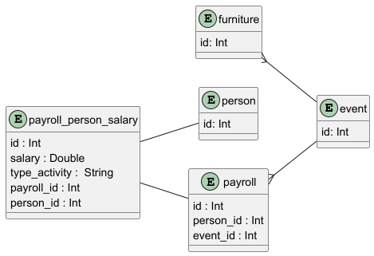

# EventManagement
El ejercicio es parte del curso de 
_Aprendiendo a programa en Android con Kotlin_,

El propósito del ejercicio consiste en desarrollar una _app_ que
permita llevar la gestión de eventos festivos.

## Historias de usuario
- Como usuario quiero registrar y consultar eventos
- Como usuario quiero registrar el personal que sera contratada para los eventos
- Como usuario quiero llevar el registro de los gastos de cada evento

## Funcionalidades
1. Registrar personal (staff, entretenimiento)
2. Registrar activos (muebles, equipos)
2. Registrar eventos
3. Registrar nominas
4. Registrar gastos

## Persistencia de datos
### Modelo Entidad-Relación

## Objetivo del ejercicio
El objetivo del ejercicio busca familiarizar a los 
participantes con las siguientes librerias, frameworks, y toolkits:
- Room
- Jetpack Compose
- Koin
- Flow
- Coroutines
